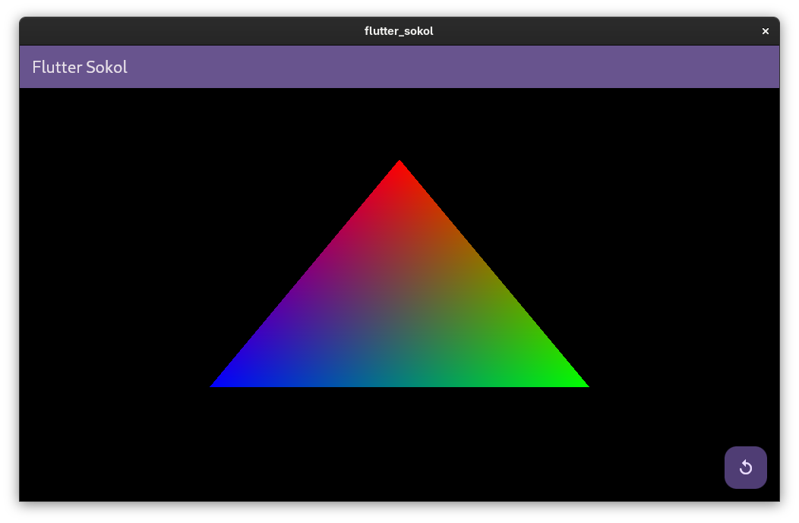

# Flutter Sokol

A demo project showing how to combine Flutter and Sokol on Linux.

## Why?

[Sokol](https://github.com/floooh/sokol) is a neat, portable, lightweight graphics library. [Flutter](https://flutter.dev/) is one of the most advanced cross-platform UI frameworks. Being able to use both together could be great for games or apps that require both high performance graphics and an advanced interface. Both Sokol and Flutter support Windows, macOS, Linux, iOS, and Android. What is more, there is a common supported 3D API for each (Metal on iOS and macOS, OpenGL on Linux, Direct3D on Windows, and Vulkan on Android), making integration possible (hopefully).

## Status

Right now it only runs on Linux. I hope to add support for the other platforms in the future; pull requests are welcome!

## Why Rust?

I’m using Rust in my current project that this experiment is for. But you could potentially do this in C, Zig, or whatever you fancy.

## Why are you passing around a memory address?

We could wrap the state object in an `Arc<Mutex<>>`, but this means that we always need to get a lock, even when calling from within Rust. When you need to do this every frame, you run into performance issues. So instead, I’m storing the address in an `AtomicUsize`, which Flutter only has to access once and then can store for all future requests. It’s very unsafe, yes, but it’s also fast.
